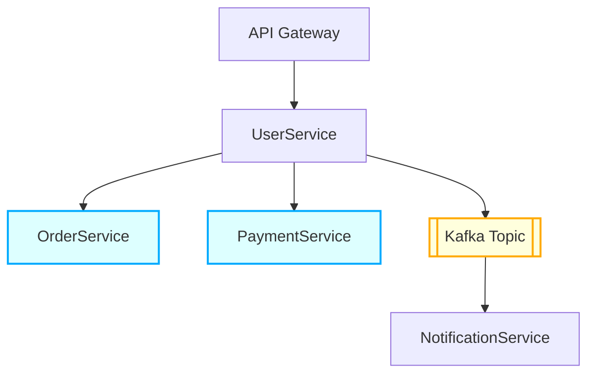

# Innovus Labs - Backend Developer Take-Home

This repository contains the solution for the backend engineering coding exercise using **Kotlin + gRPC**.

## Project Structure

```
.
├── exercise-1/      # Unary gRPC call
├── exercise-2/      # Server streaming gRPC
├── exercise-3/      # Architectural Design
└── README.md        # This file
```

---

## Exercise 1 – Unary gRPC (GetUser)

### Objective
Implement a basic `UserService` with a unary gRPC method that returns user information by ID.

### `.proto` Definition
```proto
syntax = "proto3";

service UserService {
  rpc GetUser (GetUserRequest) returns (UserResponse);
}

message GetUserRequest {
  string user_id = 1;
}

message UserResponse {
  string user_id = 1;
  string name = 2;
  string email = 3;
}
```

### Implementation
- `UserServiceImpl` extends `UserServiceGrpc.UserServiceImplBase`.
- The `GetUser` method returns a hardcoded user:
    - user_id: `"10"`
    - name: `"Alejandro"`
    - email: `"alejandro@mail.com"`

### How to Run
1. Navigate to the correct directory:
```bash
cd exercise-1
```
2. Build the project:
```bash
./gradlew clean build
```
3. Run the gRPC server:
```bash
./gradlew run
```

---

## Exercise 2 – gRPC Streaming (ListUsers)

### Objective
Extend the previous service to support **server streaming**, sending multiple users to the client.

### Extended `.proto`
```proto
service UserService {
  rpc GetUser (GetUserRequest) returns (UserResponse);
  rpc ListUsers (ListUsersRequest) returns (stream UserResponse);
}

message ListUsersRequest {
  string filter = 1;
}
```

### Implementation
- In `ListUsers`, the server returns a simulated list of users using:
    - `responseObserver.onNext(...)` for each user.
    - `responseObserver.onCompleted()` when done.

### Example Streamed Users
```json
[
  { "user_id": "1", "name": "Alejandro", "email": "alejandro@mail.com" },
  { "user_id": "2", "name": "Jose", "email": "jose@mail.com" },
  { "user_id": "3", "name": "Cintia", "email": "cintia@mail.com" }
]
```

### How to Run
1. Navigate to the correct directory:
```bash
cd exercise-2
```
2. Build the project:
```bash
./gradlew clean build
```
3. Run the gRPC server:
```bash
./gradlew run
```

---

## Tech Stack

- Kotlin
- gRPC
- Protocol Buffers
- Gradle

---

## Time Spent

- Exercise 1: ~45 minutes
- Exercise 2: ~30 minutes
- Exercise 3: ~45 minutes

## Challenges Faced

One of the main challenges was configuring **Protocol Buffers** in the `build.gradle.kts` file:

- Ensuring the correct version of the `protobuf-gradle-plugin` was applied.
- Setting up the `sourceSets` and `generateProtoTasks` to work properly with Kotlin and gRPC.
- Coordinating `grpc`, `protobuf`, and Kotlin dependencies to avoid version conflicts.

Once resolved, code generation and integration with gRPC services worked as expected.

## Exercise 3 – Architectural Design

### Architecture Diagram


